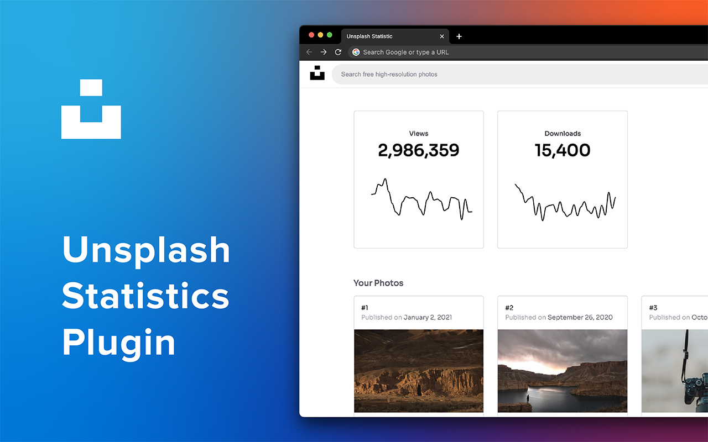

## Chrome Unsplash Statistic



Unsplash Statistic is a chrome extension for photographers who wants to check their Unsplash account statistic on regular basis.

This is the very first version of this extension and will be updated every month. In this version you will be able to see the number of downloads and views of each uploaded photos to your Unsplash Account.

## Development Setup

Clone the project and run the following commands:

```
npm install
npm run serve
```